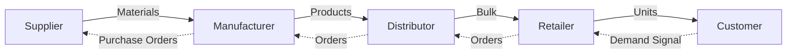

# What is Supply Chain

> **Source:** Chopra Ch.1 · Kuldeepak Ch.1
> **Tags:** #foundations #definition #scm

---

## Definition

**Chopra:** A supply chain consists of all parties involved, directly or indirectly, in fulfilling a customer request. It includes not only the manufacturer and suppliers but also transporters, warehouses, retailers, and even customers themselves.

**Kuldeepak:** An interconnected system consisting of the network of physical and virtual flow of goods and services to satisfy customer demand at desired service levels and at optimum cost.

---

## Two Types of Flow

### Physical Flow
Movement of people, raw materials, and finished goods within or outside an organisation.

### Virtual Flow
Flow of cash and management information systems — designed to ensure low risk, minimal deviation from objectives, and maximum visibility for decision-making.

---

## Three Key Flows in a Supply Chain (Chopra)

```
Supplier → Manufacturer → Distributor → Retailer → Customer
        ←←←←←←←  Information Flow  →→→→→→→
        →→→→→→→  Product Flow  →→→→→→→→→
        ←←←←←←←  Fund Flow  ←←←←←←←←←
```

| Flow | Direction | Content |
|---|---|---|
| **Product** | Downstream | Goods, raw materials, returns |
| **Information** | Both ways | Demand, orders, forecasts, inventory |
| **Fund** | Upstream | Payments, credits, financing |

---

## The Goal: Maximise Supply Chain Surplus

```
Supply Chain Surplus = Customer Value − Supply Chain Cost
```

- The customer is the **only source of revenue** in a supply chain
- All other cash flows are fund exchanges between stages
- Higher surplus = more profitable and successful supply chain
- Focus on **total network profit**, not individual stage profit

---

## Typical Supply Chain Stages



---

## Toyota Supply Chain Example (Chopra)

- Customer needs a car → visits Toyota dealer
- Dealer holds inventory from assembly plant (shipped via truck)
- Assembly plant receives modules from Tier 1 suppliers (electronics, powertrain)
- Tier 1 suppliers source from Tier 2 (cameras, displays)
- Tier 2 sources raw materials from lower-tier suppliers

---

## Amazon Supply Chain Example

- Customer places order online → warehouse picks and ships
- Website provides pricing, variety, availability information
- As inventory depletes → warehouse replenishes from suppliers
- Carrier delivers to customer (last-mile)

---

## Key Characteristics

- **Dynamic system** — constant flow of information, product, funds
- **Interconnected network** — not a linear chain but a web
- **Customer-centric** — customer is integral part and sole revenue source
- **Data-driven** — information flow enables coordination
- **Cost-sensitive** — every flow generates cost

---

## Related Concepts
- [[Supply Chain Surplus]]
- [[Supply Chain vs Demand Chain]]
- [[Decision Phases]]
- [[Push vs Pull Systems]]
- [[Framework Overview]]

---

## Interview Questions
1. What is a supply chain? How is it different from a supply network?
2. Name and explain the three flows in a supply chain.
3. What is the primary objective of every supply chain?
4. Why is the customer considered part of the supply chain?
5. How do supply chain decisions impact firm profitability?
