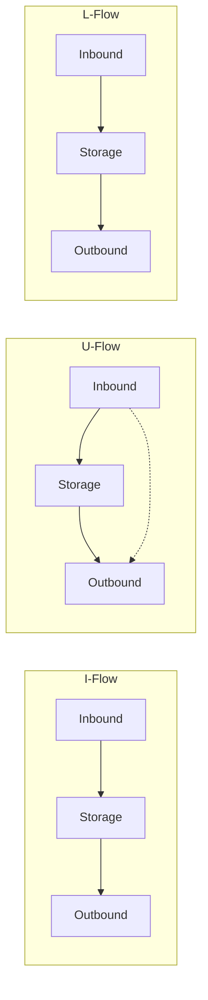

# Warehouse Design and Flow

> **Source:** Kuldeepak Ch.3
> **Tags:** #warehousing #design #flow #layout

---

## Three Design Factors (Kuldeepak)

1. **Space Requirements** — storage volume, SKU count, stacking norms
2. **Throughput Requirements** — units per hour, peak vs average
3. **Resource Utilisation** — manual, semi-automated, or fully automated

---

## Standard Warehouse Process Flow

```
Receiving → Putaway → Storage → Picking → Packing → Dispatch
```

| Stage | Description |
|---|---|
| **Receiving** | Inbound truck docks; goods unloaded, counted, inspected |
| **Putaway** | Goods moved from staging area to storage location (bin, rack, bulk) |
| **Storage** | Inventory held in rack, shelving, bulk floor, or automated system |
| **Picking** | Items retrieved based on customer order |
| **Packing** | Items packed, labeled, and readied for dispatch |
| **Dispatch** | Loaded on outbound vehicle; documentation completed |

---

## Three Layout Types (Material Flow Design)



| Layout | Description | Best For |
|---|---|---|
| **I-Flow** | Straight-through — inbound and outbound at opposite ends | High-throughput, simple product range |
| **U-Flow** | Inbound and outbound on same side; storage in the middle | Shared dock resources; flexible staffing |
| **L-Flow** | Inbound and outbound at 90° angle | Site-constrained locations; cross-docking |

---

## Warehouse Zones

| Zone | Purpose |
|---|---|
| **Receiving / Inbound Dock** | Unloading, counting, quality check |
| **Staging / Holding Area** | Temporary holding before putaway or dispatch |
| **Bulk Storage** | Large-quantity, floor-level storage (FLT access) |
| **Rack Storage** | Pallet racking for stacked storage |
| **Active / Fast Pick Area** | Frequently picked SKUs — near dispatch |
| **Picking Face** | Forward pick area fed from bulk storage |
| **Packing / Value-Added Area** | Repacking, kitting, labelling |
| **Outbound / Dispatch Dock** | Loading, documentation, staging |
| **Returns / Reverse Logistics Area** | Processing of returned goods |

---

## Resource Selection (Kuldeepak)

### Manpower
- Determined by throughput, shifts, SKU complexity

### Material Handling Equipment (MHE)
| Equipment | Role |
|---|---|
| Hand pallet truck (HPT) | Ground-level pallet movement |
| Battery-operated pallet truck | Powered version — faster, longer distance |
| Counterbalance forklift | Racking operations, loading/unloading |
| Reach truck | Narrow aisle, high rack operations |
| Scissor lift | Maintenance and elevated access |
| Conveyor belts | High-throughput automated movement |
| Automated picking robots | Fast, accurate picking in FCs (Amazon Kiva) |
| Sorting machines | High-speed parcel sorting (express, e-commerce) |

Three roles of MHE:
1. **Capacity enhancement** — more throughput and vertical storage
2. **Product velocity** — faster movement through warehouse
3. **Safety** — protect man and material

---

## Related Concepts
- [[Warehouse Types]]
- [[Warehouse KPIs]]
- [[Cross Docking]]
- [[Industry 4.0]]
