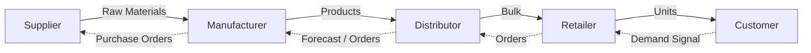
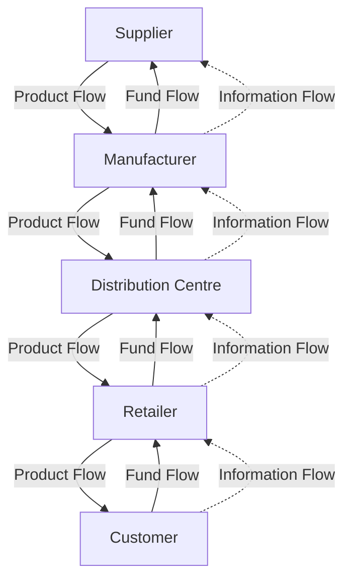
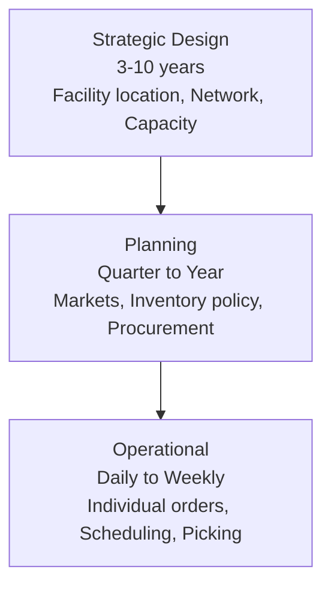
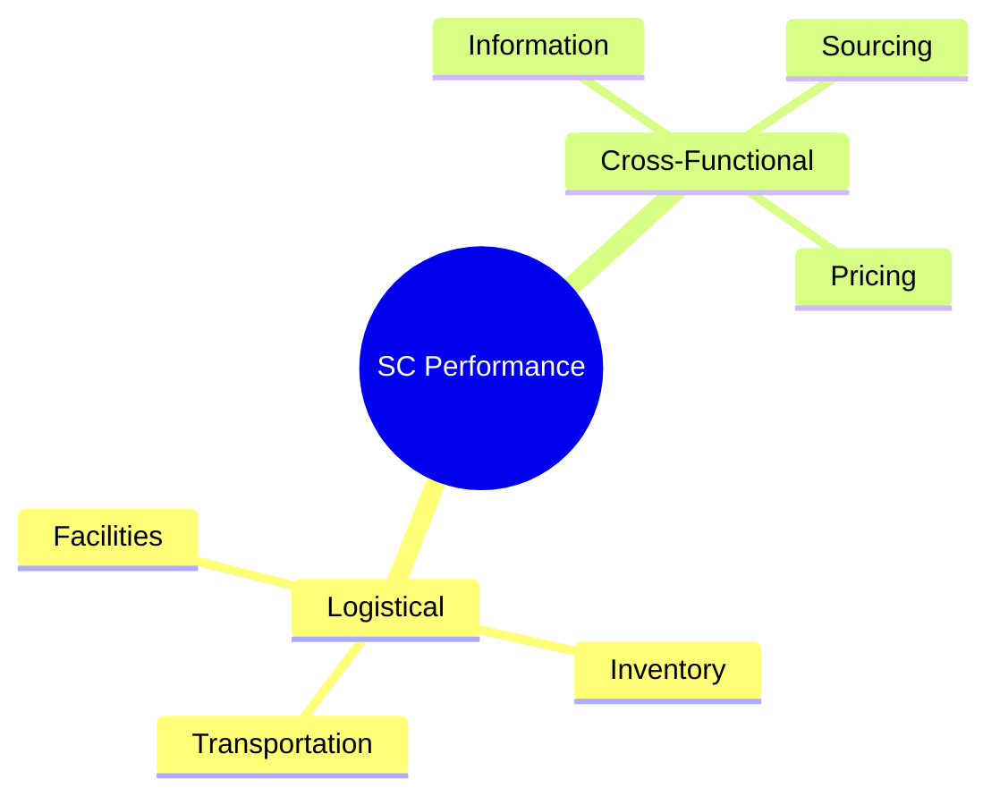
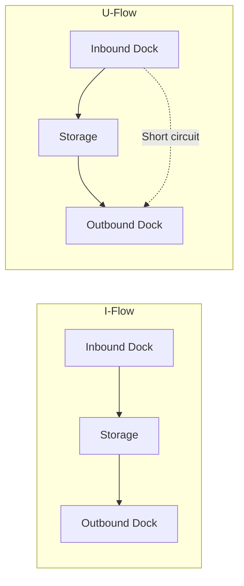
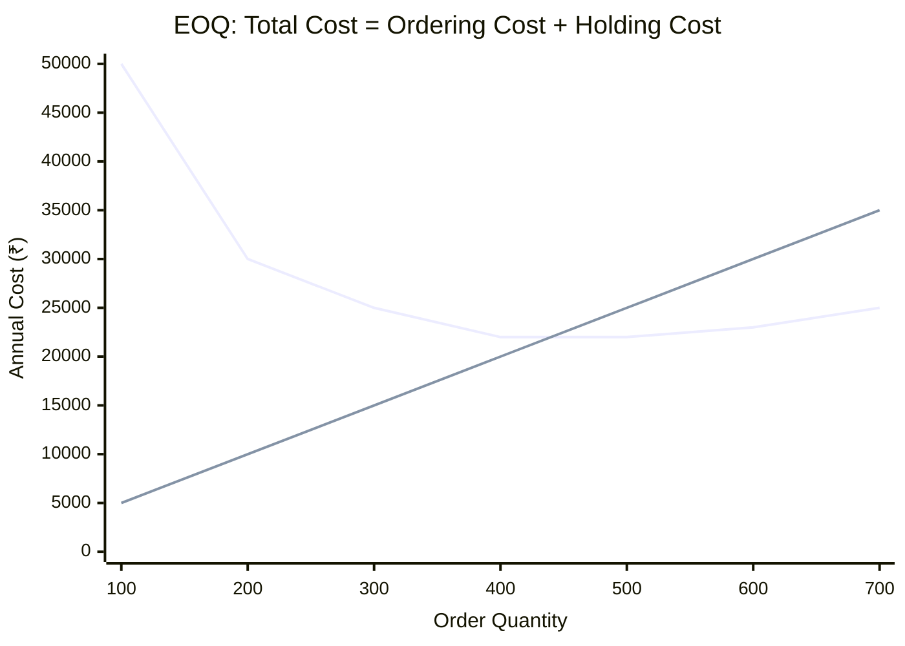
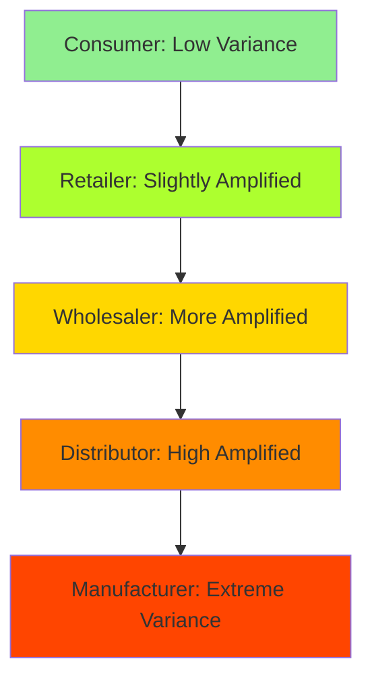
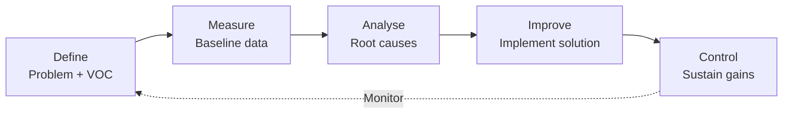
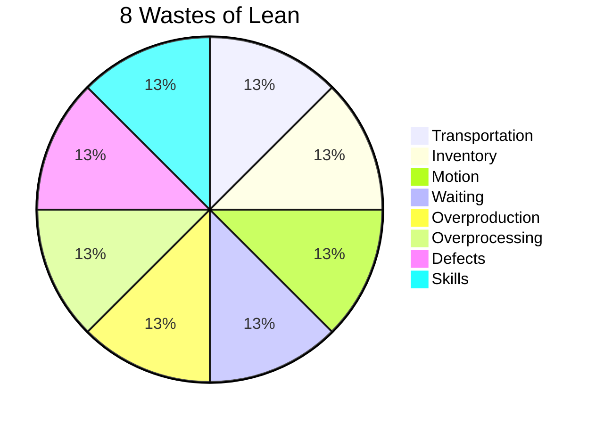
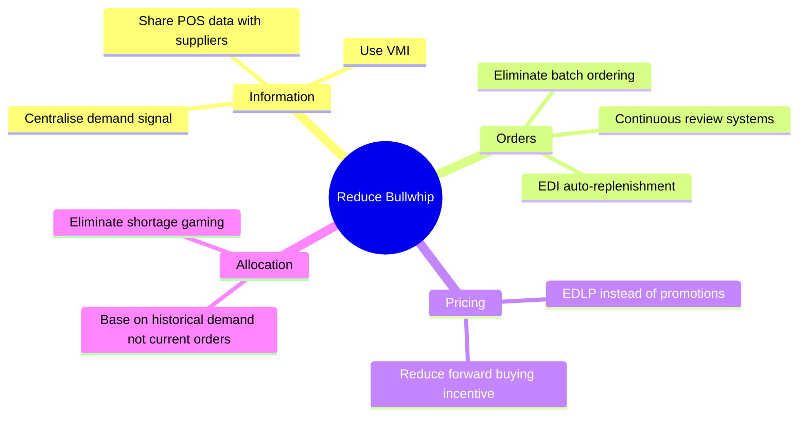

# SCM Mermaid Diagrams

> **Tags:** #diagrams #mermaid #visual

---

## Basic Supply Chain Flow

---

## Three Flows in a Supply Chain

---

## Decision Phases

---

## 6 Supply Chain Drivers

---

## Warehouse Material Flow

---

## EOQ Cost Curve

---

## Bullwhip Effect

---

## DMAIC Process

---

## Lean Wastes (TIMWOODS)

---

## Supply Chain Coordination — Bullwhip Solutions

